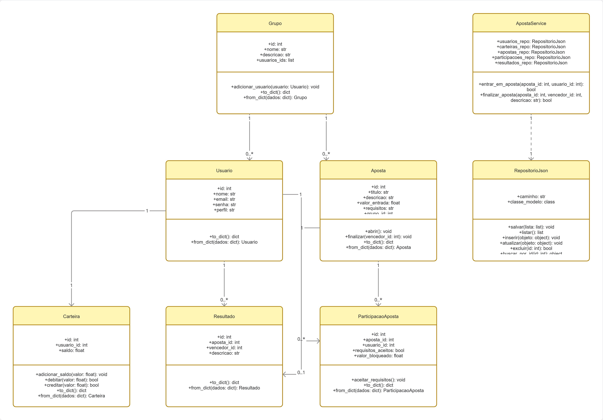

# Documento de Visão do Sistema

## Informações do Projeto

**Aluno:** Matheus Santiago
**Projeto:** Sistema de Apostas em Grupo

---

# Sistema de Apostas em Grupo

## Objetivo

Desenvolver uma aplicação orientada a objetos destinada ao gerenciamento de apostas realizadas entre membros de um mesmo grupo. O sistema permitirá o cadastro de usuários, grupos e apostas, além do gerenciamento de participantes, carteiras virtuais, resultados e distribuição automática dos prêmios.

O principal objetivo é garantir maior segurança e confiabilidade nas apostas, utilizando um sistema de saldo fictício bloqueado antes do início de cada aposta.

---

## Descrição do Problema

Em apostas informais realizadas entre amigos, é comum ocorrerem situações em que participantes deixam de cumprir o pagamento após perderem uma aposta.

Para solucionar esse problema, o sistema utiliza uma carteira virtual com saldo fictício. Antes de participar de uma aposta, o usuário deve possuir saldo suficiente e aceitar os requisitos estabelecidos. O valor correspondente permanece bloqueado durante a aposta e, após sua finalização, o sistema realiza automaticamente a transferência do prêmio ao vencedor.

Esse processo elimina a necessidade de cobranças manuais e aumenta a transparência entre os participantes.

---

## Perfis de Usuários

### Administrador

Responsável pelo gerenciamento geral do sistema, podendo:

* Gerenciar usuários;
* Gerenciar grupos;
* Gerenciar apostas;
* Registrar resultados;
* Encerrar apostas;
* Resolver conflitos administrativos.

### Participante

Usuário comum responsável por:

* Participar de grupos;
* Criar apostas;
* Aceitar apostas;
* Consultar saldo da carteira;
* Pesquisar apostas disponíveis;
* Visualizar resultados.

---

# Funcionalidades do Sistema

## Gerenciamento de Usuários

* Inserir usuário;
* Listar usuários;
* Atualizar usuário;
* Excluir usuário;
* Realizar login;
* Encerrar sessão (logout).

---

## Gerenciamento de Grupos

* Inserir grupo;
* Listar grupos;
* Atualizar grupo;
* Excluir grupo;
* Vincular usuários ao grupo;
* Pesquisar grupo por nome.

---

## Gerenciamento de Apostas

* Inserir aposta;
* Listar apostas;
* Atualizar aposta;
* Excluir aposta;
* Vincular aposta a um grupo;
* Adicionar participantes à aposta;
* Pesquisar apostas por título;
* Pesquisar apostas abertas.

---

## Gerenciamento de Carteiras

* Inserir carteira;
* Listar carteiras;
* Atualizar carteira;
* Excluir carteira;
* Consultar saldo;
* Adicionar saldo fictício.

---

## Gerenciamento de Participações

* Inserir participação em aposta;
* Listar participações;
* Atualizar participação;
* Excluir participação;
* Aceitar os requisitos da aposta;
* Bloquear automaticamente o valor da aposta.

---

## Gerenciamento de Resultados

* Inserir resultado;
* Listar resultados;
* Atualizar resultado;
* Excluir resultado;
* Finalizar aposta;
* Transferir automaticamente o prêmio para o vencedor.

---

# Regras de Negócio

* O usuário somente poderá participar de uma aposta se possuir saldo suficiente em sua carteira.
* A participação exige a aceitação dos requisitos definidos pelo criador da aposta.
* Ao aceitar a participação, o valor da aposta será bloqueado automaticamente.
* Apenas apostas abertas poderão receber novos participantes.
* Após o encerramento da aposta, o administrador informará o vencedor.
* O sistema calculará automaticamente o prêmio e realizará a transferência do saldo ao vencedor.
* Uma aposta finalizada não poderá ser alterada.

---

# Tecnologias

O sistema será desenvolvido utilizando o paradigma de Programação Orientada a Objetos (POO), com persistência de dados em arquivos JSON, organizado em camadas (Modelo, Persistência e Interface), seguindo boas práticas de desenvolvimento de software.

# Diagrama de Classes

O diagrama de classes representa a modelagem do sistema, evidenciando as entidades principais, seus atributos, métodos e relacionamentos. Ele servirá como base para a implementação da aplicação utilizando Programação Orientada a Objetos.

